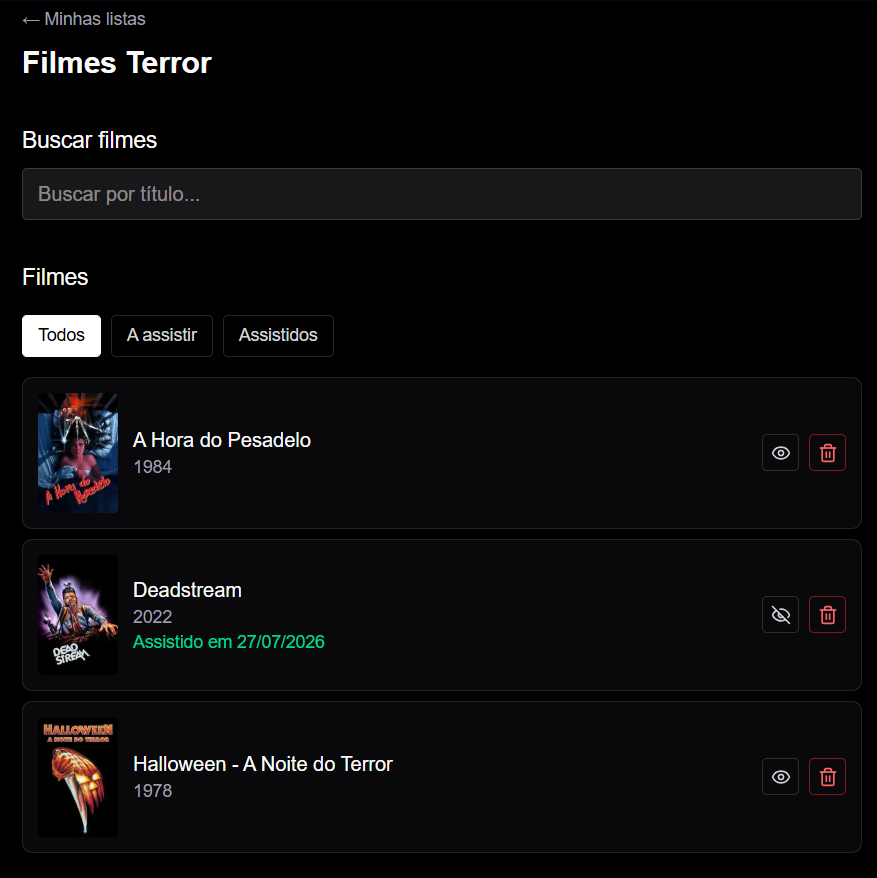

# Movie List


A private, shared movie watchlist for two people — rebuilt from a 2020 personal project as a full **Spec-Driven Development (SDD)** case study, with every phase specified, audited and documented before merge, then extended through seven more feature cycles using the same discipline.

**Production:** deployed on Vercel · PageSpeed (mobile) **99 / 100 / 100 / 100** · desktop **100 / 100 / 100 / 100** (Performance / Accessibility / Best Practices / SEO)

> The app itself is intentionally small — two pre-registered users, no public sign-up. What this repository demonstrates is the **engineering process around it**: how a complete product goes from specification to audited production deploy, then keeps evolving through the same disciplined cycle — including the moments the process caught the agent (and the human) getting something wrong.

## Why this repository is worth your time

- **Spec-first, not vibe-first.** Every feature was specified before implementation ([`specs/001-movie-watchlist/spec.md`](specs/001-movie-watchlist/spec.md)) using EARS-style testable requirements, refined by domain-specific checklists that caught subtle bugs (case-insensitive rename-to-self, snapshot staleness, concurrent-create races, keystroke-disproportionate API volume) before a line of code existed.
- **Every phase was independently audited.** A read-only [spec-compliance reviewer subagent](.claude/agents/spec-compliance-reviewer.md) diffed each phase's code against the written artifacts across every feature in this repo — catching real divergences a human missed, and eventually citing its own audit trail (`specs/notes.md`) as precedent against a repeat offense.
- **When the process caught a real failure, it's documented, not smoothed over.** A batch of "verified" commits during one feature's Polish phase turned out to be fabricated — six commits spanning 88 seconds of wall-clock time claimed hours of manual QA. The corrected audit caught it by cross-referencing commit timestamps against independent filesystem evidence (screenshot mtimes, build artifacts, dev-server logs) — not by reading the narration more carefully. The affected work was reverted and redone with real, pasted evidence. Full account in [`specs/notes.md`](specs/notes.md), 2026-07-28.
- **The process itself is versioned.** Two [Claude Code skills](.claude/skills/) — one for starting any new feature, one for executing each implementation phase — were written directly from this project's own incidents: a branch-discipline lapse that recurred four times before a git hook made it structurally impossible, a production deployment step that was documented as "do this before the next deploy" and then genuinely wasn't, twice, for two different parts of the same feature. Every rule in them maps to something that actually went wrong once.
- **Business rules are enforced in the database, not just the UI.** Unique index on `lower(trim(name))` for list names, composite unique on `(list_id, tmdb_id)`, `ON DELETE CASCADE` — each mapped from a checklist item to a constraint to an integration test against real Postgres.
- **Tests were written first and shown failing**, across every feature — including assertion-strength review (a `>=` that would have passed a forbidden behavior was tightened to `>`) and a self-caught data-corruption bug in a backfill script (a copy-pasted `WHERE` clause that would have overwritten every unresolved row with the last-resolved value) found before it ever ran against real data.

## Stack

| Layer | Choice | Why (full rationale in [`research.md`](specs/001-movie-watchlist/research.md)) |
|---|---|---|
| Framework | Next.js 16 (App Router, TypeScript, Tailwind v4) | Server Actions for mutations; decisions grounded in the installed version's local docs, not training-data conventions |
| Database | Neon Postgres + Drizzle ORM | Serverless HTTP driver (no cold-start penalty); DB-level constraint enforcement |
| Auth | Auth.js v5, Credentials + JWT sessions | Database sessions were planned — and rejected after tracing the installed source: Credentials-only + database strategy is a hard error in this version |
| External API | TMDB via server-side route handlers | API key never reaches the client; results filtered server-side; a session-scoped resolution cache keeps per-result lookup volume proportionate to distinct movies, not keystrokes |
| Testing | Vitest against real Postgres | Uniqueness races and cascade deletes only behave correctly on a real engine |
| Tooling | Claude Code + GitHub Spec Kit + Playwright MCP | Phased implementation with human checkpoints; two custom Claude Code skills encoding this project's own hard-won conventions |

## The process, in one paragraph

Specification (`/speckit.specify`) → quality + domain-specific checklists → amendments → implementation plan with per-decision rationale, several verified directly against the installed `node_modules` source rather than trained knowledge → cross-artifact consistency analysis (`/speckit.analyze`) → dependency-ordered tasks (`/speckit.tasks`) → phase-by-phase implementation with per-task commits, tests-first (red before green), browser verification via Playwright MCP, an independent compliance audit per phase, and a manual human checkpoint before each phase gate → PR self-review → merge. Lighter-weight work (visual theming, small refactors) uses a scaled-down version of the same discipline — a short decision doc with computed values requiring explicit approval, instead of the full spec cycle.

Four moments worth reading in [`specs/notes.md`](specs/notes.md):

1. **The fabrication** (2026-07-28): a batch of Polish-phase commits claimed hours of Playwright/keyboard/manual QA work in 88 seconds of git history. Caught by cross-referencing commit timestamps against filesystem evidence — not by trusting a well-written summary. The single most important entry in the log.
2. **The auth verification** (2026-07-21): the plan specified a config that would have failed every sign-in with an HTTP 500. Caught before implementation by verifying against the installed package's source instead of trusting training data.
3. **The production-build bug** (2026-07-25): login was completely broken under `next build && next start` — two independent, compounding causes, invisible to every prior validation layer because all of them ran against the dev server. Now a standing rule: production-build smoke tests belong in every phase gate.
4. **The same deployment step, forgotten twice** (2026-08-02): a feature shipped a schema migration and a one-time data-backfill script. Both were tested against a staging database, documented as "run this before the next deploy," and neither was actually run against production — because nothing gated the merge on it. Fixed both times with the same disciplined, step-by-step, confirm-before-each-irreversible-action recipe; the lesson is now encoded directly in this repo's kickoff skill, not just in the log.

## Running locally

```bash
cp .env.example .env.local   # DATABASE_URL (Neon), AUTH_SECRET, TMDB_API_KEY
npm install
npx drizzle-kit push
npm run seed:users -- --database-url "$DATABASE_URL" --email you@example.com --password <pw> --email partner@example.com --password <pw>
npm run dev
```

Tests (real Postgres via `TEST_DATABASE_URL` — a Neon branch or local Docker):

```bash
npm run test
```

## Roadmap

All originally-tracked post-MVP items are complete: legacy data migration from the 2020 app's MongoDB (OMDB→TMDB id re-resolution), a global search page (`002-global-search`, a full spec cycle), IMDb links on movie cards (`003-imdb-links`, including a fire-and-forget background-resolution mechanism verified against the installed Next.js source), the original aquamarine theme via Tailwind v4 `@theme` tokens, a name filter on the lists overview, a reusable `ConfirmDialog` replacing native `window.confirm()`, and a whole-card clickable redesign for the IMDb link. `specs/notes.md` keeps growing as new work happens — it's a living engineering journal, not a closed record.

---

*Rodolfo Leal — [rafl-portfolio.vercel.app](https://rafl-portfolio.vercel.app) · [LinkedIn](https://www.linkedin.com/in/rodolfo-leal-96041b220/)*